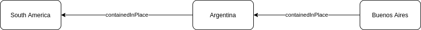

# Data Commons REST API

The Data Commons REST API is a [REST](https://en.wikipedia.org/wiki/Representational_state_transfer) library that enables developers to programmatically access data in the Data Commons knowledge graph. This package allows users to explore the structure of the graph and integrate statistics from the graph into data analysis applications and much more.

## Getting Started

First time using the Data Commons API, or just need a refresher? Take a look at our [Getting Started Guide](/api/rest/v1/getting_started).

# Data Commons REST (v2) API Overview

This section introduces the new APIs and components in the Data Commons REST (v2) API, which simplifies the REST (v1) API by using property chaining with relation expressions and filtering. In this way all existing APIs can be represented by a single API. For more information on service endpoints and other basic REST API information, refer to the [Data Commons REST (v1) API page](https://docs.datacommons.org/api/rest/v1).

## Introducing the REST (v2) APIs

The following table describes the new endpoints in Data Commons REST (v2) API:

| Endpoint    | Retrieves                                                                                                | Link            | 
|-------------|----------------------------------------------------------------------------------------------------------|-----------------| 
| node        | Node information for edges and neighboring node information.                                             | /v2/node        | 
| observation | Statistical observations. An observation is associated with an entity and variable at a particular date. | /v2/observation | 
| resolve     | [NEED]                                                                                                   | /v2/resolve     | 
| event       | [NEED]                                                                                                   | /v2/event       | 
{: .doc-table}

The Data Commons REST API is a
[REST](https://en.wikipedia.org/wiki/Representational_state_transfer) library
that enables developers to programmatically access data in the Data Commons
knowledge graph. This package allows users to explore the structure of the
graph, integrate statistics from the graph into data analysis applications and
much more.

## Getting Started

First time using the Data Commons API, or just need a refresher? Take a look at
our [Getting Started Guide](/api/rest/v1/getting_started).

## Service Endpoints

The base URL for all endpoints below is:

```bash
https://api.datacommons.org/v2
```

## Understanding Relation Expressions

The REST (v2) API introduces relation expressions that include arrow annotation and other symbols in the API syntax to represent neighboring nodes, and to support chaining and filtering. For example, nodes from “out” arcs are represented by “->”, while nodes from “in” arcs are represented by “&lt;-”. For example:

* All counties in California: “geoId/06&lt;-countyIn”
* All cities in California: “geoId/06&lt;-cityIn”
* Child stat vars under an SVG: “dc/g/Demographics**<-**memberOf”

The following table describes the new Data Commons REST (v2) relation expressions:

| Symbol      | Represents                                  |
|-------------|---------------------------------------------|
| ->          | An “out” arc                                |                      
| <-          | An “in” arc                                 |                      
| +           | One or multiple properties chained together, like “containedInPlace+” |
| *           | Wildcard matches                            |                    
| #           | A count of nodes                            |                           
| {p:v}       | Filtering                                   |                           
| []          | A list of nodes                             |
{: .doc-table}

Data commons represents real world entities, concepts, and data as nodes. These nodes are connected by a relationship and form a connected knowledge graph. Nodes are connected by edges. One edge represents the relationship between the two nodes, which we also call a “property”. Users can use “property” to query for linked nodes in the knowledge graph. Since the relationships between nodes are directed, we want to represent that with direction, hence using arrow notation, like “->” or “&lt;-”. With this in mind, understand that a property (node relation) has two parts: the direction (represented by arrow notation) and the label. For example “->name”, “&lt;-containedInPlace”.

> **Note**: Properties to query must be represented with relation expressions such as arrow notation. For more information, see the Data Commons REST (v2) API Overview.

## Chaining Properties

In REST (v2) APIIn REST (v2) API, you can represent a chain of the same property with “+”. For example, to find places that are related by containment relationship, we can use “containedInPlace+”. For example, locations in the USA can be represented to find places that are related by containment relationship, we can use “containedInPlace+”. For example, locations in the USA can be represented to find places that are related by containment relationship, we can use “containedInPlace+”. For example:

```
country/USA<-containedInPlace+
```

This makes it possible to extend the “property” to more than one node connection.

A filter, represented by “key: value” pairs can be further applied on top of this to limit the target nodes. In the above example, if we only want to get cities in USA, the expression looks like:

```
country/USA<-containedInPlace+{typeOf: City}
```

This makes it clear that nodes with “typeOf: City” are queried and are linked to “country/USA” by one or more “containedInPlace” properties.

As an example of property chaining, consider the following diagram:



The property `containedInPlace` is chained. Buenos Aires is contained in Argentina, which is itself contained in South America – implying Buenos Aires is also contained in South America. With this endpoint, you could query for countries in South America (returning Argentina) or for cities in South America (returning Buenos Aires). Keep in mind that this property is only for chaining.

By using chaining, you have a flexible way to express the knowledge graph. Since a node can be chained together, you can further expand the relation by chaining multiple properties together like “->containedInPlace->containedInPlace->containedInPlace”. This construct can be shortened as “->containedInPlace+”. Combining a source node and a property (chain), we can represent the target nodes: “geoId->name”. Getting all linked nodes for a given source node can be simplified with the “->\*” symbol.

Also, to query multiple properties at the same time, you can use a list of properties contained within square brackets like “geoid->[name, latitude, longitude]". Going further, users can filter the linked nodes with this construct: “{property: value}”. Here the “property” is a constraint on the linked nodes. Note that this syntax is only for chaining.

## Implementing the API

The Data Commons REST (v2) API uses the following form:

```
GetData([*entity_list*], [*property_chain_expression*], *compact_response*)
```

The response is a generic list of nodes for which you have queried.

### Entities List

A node or list of nodes for which you want to query.

### Property Chain Expression

A property chain expression  represents one or multiple properties connected by arrow annotation, but without filters. Here are some examples:

* `->name`
* `<-containedInPlace{typeOf: City}`
* `<-containedInPlace+{typeOf: County}->name`
* `->geneID->inChromosome&lt;-inChromosome{typeOf: GeneticVariant}`

### Compact Response

When a compact response is set the response is grouped by the queried properties in a multiple-level map.

