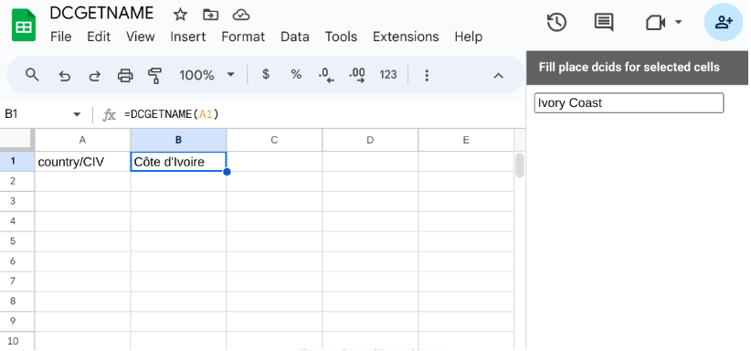
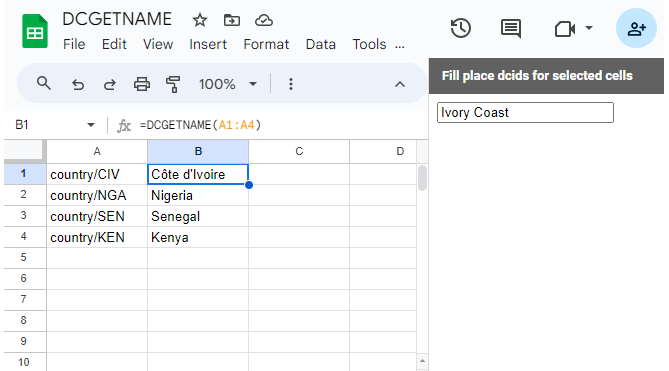
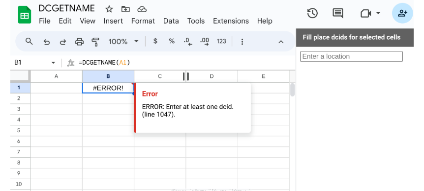

# Get a node's name

Given a cell or a column range of cells with [DCIDs](/glossary.html#dcid) (unique identifiers for all entities in the Data Commons knowledge graph), return the names associated with the given DCIDs.

## General information about this formula

**Formula**: `=DCGETNAME(dcids)`

**Required arguments**:

* `dcids` - A list of nodes to query, identified by their DCIDs.

## Examples

Before trying this method out, make sure to follow the setup directions in [the main section for Sheets docs](/api/sheets/index.html).

### Example 1: Retrieve the name of a country by its DCID.

### Example 2: Retrieve the names of a collection of cell lines.

> **TIP:**
> 
> It's best to minimize the number of function calls to `DCGETNAME` by using a single call to get names for a column of nodes. This is because a spreadsheet will make one call to a Google server [per custom function call](https://developers.google.com/apps-script/guides/sheets/functions#optimization). If your sheet contains thousands of separate calls to `DCGETNAME`, expect it to be slow and with errors.

## Error returns

If a DCID does not exist, this method returns nothing:

If an empty cell is provided as a DCID, this method returns an error value:

