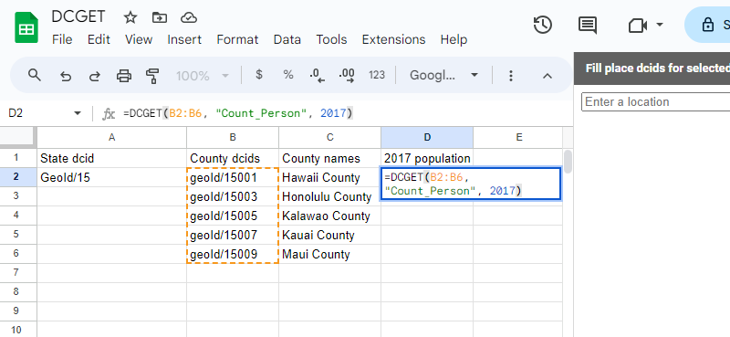
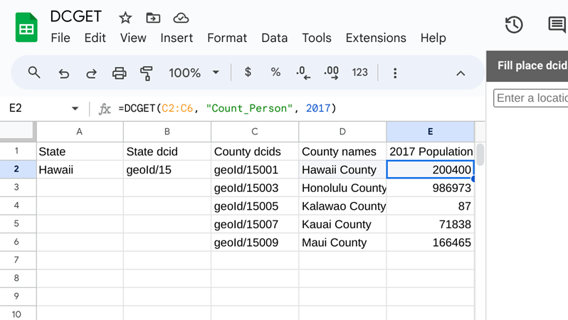
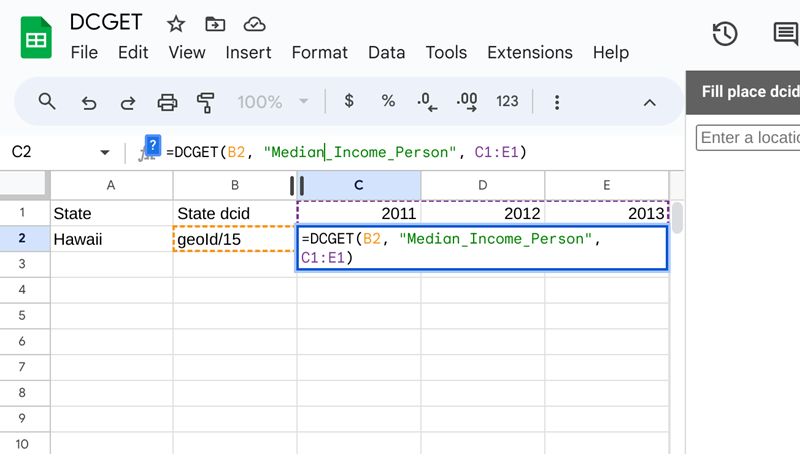
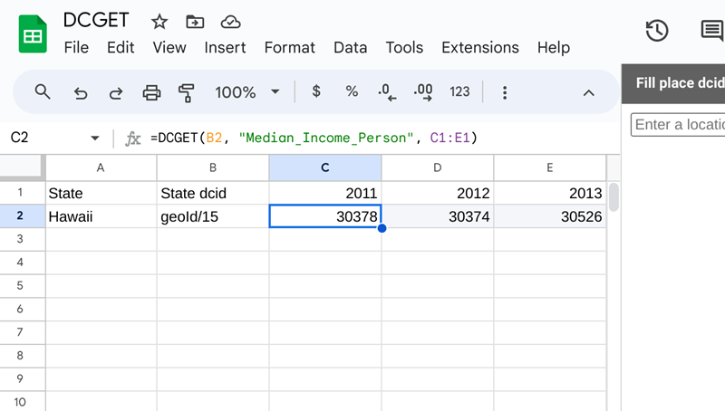
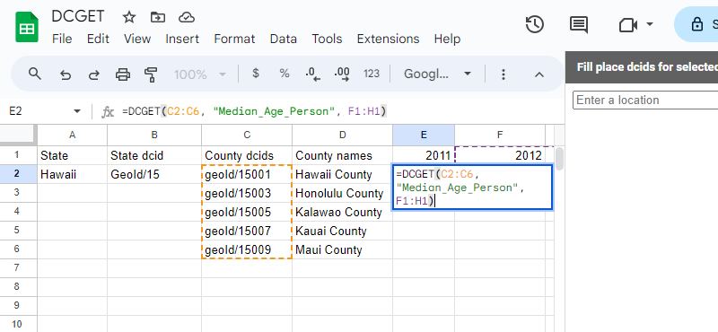
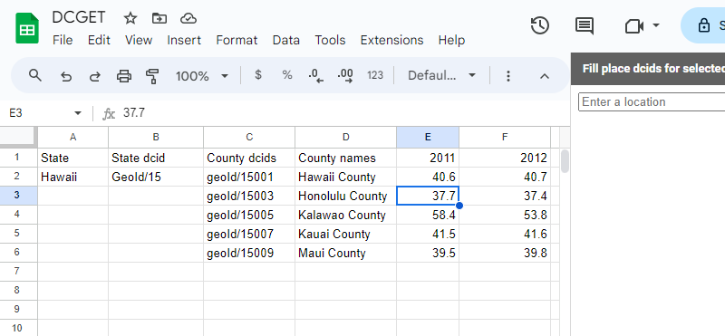
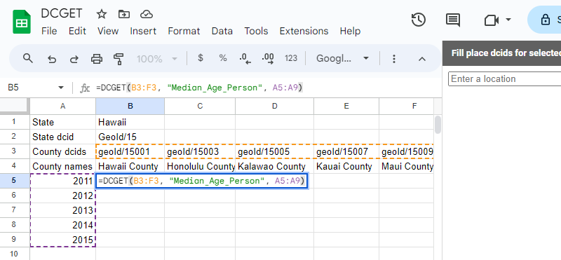
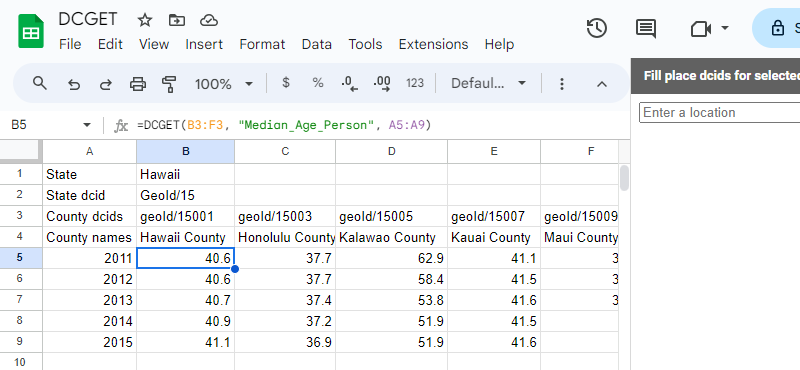
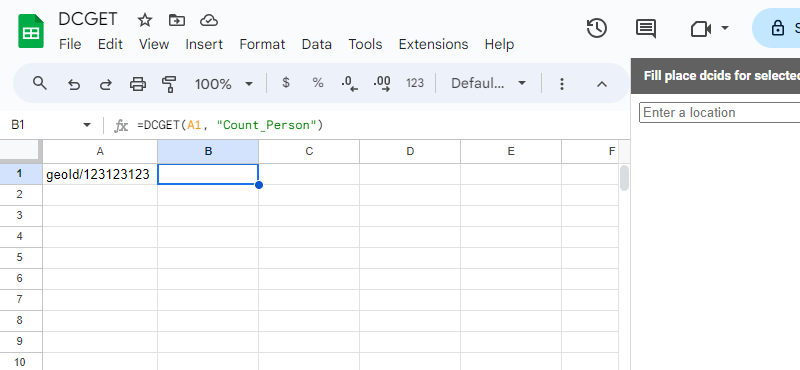

# Returning Statistical Variables

The`=DCGET(dcids, variable, date)` formula returns the measurements of a specified [statistical variable](https://docs.datacommons.org/glossary.html#variable) at a given place and optional time based on a list of parent [Place](https://datacommons.org/browser/Place) [DCIDs](https://docs.datacommons.org/glossary.html). A complete list of variables can be found in the [graph browser](https://datacommons.org/browser/StatisticalVariable).

> **Note**:
> Be sure to follow the instructions for Installing and Enabling the Sheets Add-On before using this formula.

## Formula

=DCGET(*dcids*, *variable*, *date*)

## Required Arguments

● [dcids](https://docs.datacommons.org/glossary.html): A list of `Place` nodes, identified by their DCIDs.

● `variable` - The [statistical variable](https://docs.datacommons.org/glossary.html#variable) whose measurements you want to query.

## Optional Arguments

`date` - The date or dates of interest. If this argument is not specified, the API returns the latest variable observation. You can specify this argument as a single value, row, or column. All dates must be in ISO 8601 format (such as 2017, “2017”, “2017-12”) or as a Google sheets [date value](https://support.google.com/docs/answer/3092969?hl=en).

## Returns

The value of the variable at those places on the specified date or on the latest available date, if no date is specified.

> **Note**:
> It’s best to minimize the number of function calls to `=DCGET(dcids, variable, date)` by using a single call to get the names for a column of nodes. This is because a spreadsheet will make one call to a Google server [per custom function call](https://developers.google.com/apps-script/guides/sheets/functions#optimization). If your sheet contains many thousands of separate calls to `=DCGET(dcids, variable, date)` you can expect it to be slow and return with errors.

## Examples

This section contains examples of using the `=DCGET(dcids, variable, date)` formula to returns lists of [statistical variable](https://docs.datacommons.org/glossary.html#variable) such as "Count_Person" and "Median_Income_Person". A complete list of variables can be found in the [graph browser](https://datacommons.org/browser/StatisticalVariable).

### Get the Total Population of Hawaii in 2017

The following formula returns the total population of Hawaii in 2017 using the "geoId/15" DCID and "Count_Person" variable:

```
=DCGET("geoId/15", "Count_Person", 2017)
```

Running the preceding formula returns a value of 1425763.

### Get the Population of Multiple Places with a Single Call

The following sheet returns the population of the five Hawaii counties in 2017. Column A contains the Hawaii state DCID of "geoId/15" and column B contains the county DCIDs. Column C uses the `=DCGETNAME()` formula to retrieve the county names based on the values in column B. Column D uses the following formula to retrieve the 2017 population:

```
=DCGET(B2:B6, "Count_Person", 2017)
```



Here is the output after running the `=DCGET(B2:B6, "Count_Person", 2017)`:



### Get the Median Income of a Single Place in Multiple Years

The following sheet demonstrates how to retrieve the median income from a single place in multiple years. Cell C2 uses the DCID for Hawaii (geoId/15) from cell B2 to retrieve the data using the following formula:

```
=DCGET(B2, "Median_Income_Person", C1:E1)
```



Here is the output after running the `=DCGET(B2, "Median_Income_Person", C1:E1)` formula:



### Get the Median Age of Multiple Places in Multiple Years

The following sheet demonstrates how to retrieve the median age of multiple places in multiple years, with places as a column and dates as a row. Cell E2 uses the Hawaii county DCIDs from column C to retrieve the data using the following formula:

```
=DCGET(C2:C6, "Median_Age_Person", F1:H1)
```



Here is the output after running the `=DCGET(B2:B6, "Median_Income_Person", E1:G1)` formula:



Here's another example, but this time with places as a row and dates as a column using the formula:

```
=DCGET(B3:F3, "Median_Age_Person", A5:A9)
```



Here is the output after running the `=DCGET(B3:F3, "Median_Age_Person", A5:A9)` formula:



## Error Returns

The`=DCGET(dcids)` formula returns a blank value under the following circumstances:

* A DCID does not exist
* You provide a nonexistent statistical variable
* You provide an invalidly formatted date

For example, because the “geoId/123123123” DCID does not exist, no value is returned to cell B1 in the following sheet for the formula `=DCGET(A1, "Count_Person")`:


If you fail to provide all required arguments, you will receive an error:


